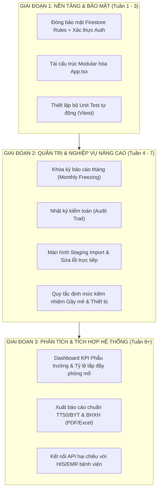

# Kế Hoạch Chiến Lược Nâng Cấp & Tối Ưu Hệ Thống SurgicalDataPro

Tài liệu này tổng hợp toàn bộ nghiên cứu chuyên sâu về mặt **nghiệp vụ y tế**, **kiến trúc phần mềm**, và **an toàn thông tin** cho ứng dụng **SurgicalDataPro** (Hệ thống Xử lý & Quản lý Dữ liệu Phẫu thuật - Thủ thuật), nhằm phục vụ việc xem xét, đánh giá và phê duyệt triển khai cho các giai đoạn phát triển tiếp theo.

---

## 1. Đánh Giá Hiện Trạng Codebase & Các Điểm Rủi Ro (Current State & Risks)

### 🔴 Điểm Rủi Ro Khẩn Cấp (P0 - Critical Security & Compliance)
1. **Quyền truy cập Firestore hoàn toàn mở (`firestore.rules`):**
   - **Hiện trạng:** `allow read, write: if true;` trên toàn bộ collections.
   - **Rủi ro:** Bất kỳ ai có thông tin Firebase API Config (vốn công khai trên client JS) đều có thể dùng script đọc hoặc xóa sạch toàn bộ dữ liệu ca phẫu thuật, thông tin bệnh nhân, danh mục cán bộ y tế.
   - **Hậu quả pháp lý:** Vi phạm nghiêm trọng **Nghị định 13/2023/NĐ-CP** về Bảo vệ dữ liệu cá nhân (dữ liệu y tế là dữ liệu cá nhân nhạy cảm) và **Luật Khám bệnh, chữa bệnh 2023**.
   - **Giải pháp:** Thiết lập Firebase Authentication hoặc cơ chế xác thực Token, đóng Firestore Rules theo vai trò người dùng (Role-Based Access Control - RBAC).

2. **Cơ chế xác thực quản trị lưu trữ Plain-text trên trình duyệt:**
   - **Hiện trạng:** Mật khẩu mở khóa tab Cấu hình lưu trực tiếp tại `localStorage.getItem('admin_config_password') || '123456'`.
   - **Rủi ro:** Không có mã hóa/băm (hash + salt), bất kỳ ai mở Developer Tools (F12) hoặc console đều đọc được. Khi người dùng xóa cache/cookie, mật khẩu tự động reset về `123456`.

---

### 🟡 Điểm Nợ Kỹ Thuật & Kiến Trúc (P1 - Architecture & Maintainability)
1. **"God Component" `App.tsx` (> 4,460 dòng):**
   - **Hiện trạng:** `App.tsx` đang gánh vác: điều hướng subtab, quản lý state báo cáo ngày/tháng, xử lý tính toán xung đột kíp mổ/máy mổ, bảng hiển thị, logic in ấn và xuất báo cáo.
   - **Rủi ro:** Mã nguồn có độ ghép nối (coupling) quá cao. Bất kỳ sự thay đổi vị trí hook hay khai báo biến nào cũng có thể gây crash toàn trang (như lỗi `ReferenceError: Cannot access 'currentReport' before initialization` vừa gặp phải).
   - **Giải pháp:** Tái cấu trúc theo kiến trúc Feature-Driven (tách `features/daily-report`, `features/monthly-report`, `features/configuration`, `hooks/useConflictDetection`, `hooks/useReportState`).

2. **Thiếu vắng hệ thống Kiểm thử Tự động (Automated Test Suite):**
   - **Hiện trạng:** Ứng dụng hiện tại chưa có bộ kiểm thử tự động (Unit Test / Integration Test).
   - **Rủi ro cực lớn:** Các thuật toán cốt lõi liên quan trực tiếp đến quyền lợi người lao động và tài chính bệnh viện (tính phụ cấp ca phẫu thuật theo Quyết định 73/2011/QĐ-TTg, phát hiện trùng kíp mổ với ngoại lệ bác sĩ gây mê, phân bổ kíp tăng cường ngoài giờ) nếu vô tình bị sửa đổi sai sót sẽ gây thất thoát hoặc sai lệch chi trả lương/phụ cấp.
   - **Giải pháp:** Cài đặt `Vitest` và thiết lập bộ kiểm thử đơn vị cho toàn bộ các hàm thuần túy (pure functions) trong `services/excelProcessor.ts` và bộ lọc tính toán.

3. **Mô hình Dữ liệu Firestore & Khả năng Mở rộng (Scalability):**
   - **Hiện trạng:** Mỗi ca mổ được lưu thành 1 document độc lập trong collection `processed_records`.
   - **Rủi ro:** Một bệnh viện đa khoa trung bình thực hiện từ 15.000 – 40.000 ca mổ/năm. Khi truy vấn báo cáo năm hoặc đối soát nhiều tháng, ứng dụng phải tải hàng chục ngàn documents, gây chậm băng thông, lag trình duyệt và vượt hạn mức đọc (Read Quota) miễn phí/tiêu chuẩn của Firebase.
   - **Giải pháp:** Bổ sung cơ chế lưu trữ Snapshots tổng hợp theo tháng (`monthly_summaries`) và cơ chế cache phía Client (IndexedDB / Local Cache).

---

## 2. Các Chức Năng Cần Bổ Sung (Feature Gaps & Proposed Solutions)

### A. Nhóm Quản Trị Chặt Chẽ & Chống Gian Lận (Governance & Compliance)
1. **Khóa kỳ dữ liệu Báo cáo Tháng (Monthly Record Freezing):**
   - **Mục đích:** Sau khi Phòng Kế hoạch Tổng hợp hoặc Phòng Tài chính Kế toán đã chốt số liệu thanh quyết toán phụ cấp ca mổ của tháng X, quản trị viên có thể bấm "Khóa sổ tháng X".
   - **Nghiệp vụ:** Khi đã khóa sổ, toàn bộ ca mổ trong tháng đó chỉ được xem/in/xuất báo cáo, không được phép chỉnh sửa, thêm hoặc xóa (Read-only lock) trừ khi có quyền Super Admin mở khóa đặc biệt kèm lý do giải trình.

2. **Nhật ký Kiểm toán (Audit Trail & Change Tracking):**
   - **Mục đích:** Truy vết minh bạch mọi thao tác can thiệp vào dữ liệu ca mổ.
   - **Thông tin lưu lại:** Ai sửa ca mổ số mấy? Lúc mấy giờ? Sửa trường thông tin gì (ví dụ: đổi PTV chính từ BS A sang BS B, đổi loại phẫu thuật từ Loại 2 lên Loại 1)? Giá trị trước và sau khi sửa.

3. **Bảng Đối Soát 2 Chiều (Reconciliation View: Lịch Mổ Dự Kiến vs. Thực Tế):**
   - **Mục đích:** So khớp danh sách ca mổ thực tế xuất từ HIS với Danh sách Đăng ký Lịch mổ kế hoạch đầu ngày để phát hiện ngay:
     - Ca mổ phát sinh cấp cứu ngoài lịch.
     - Ca mổ đã đăng ký nhưng bị hoãn/hủy (nguyên nhân gì?).
     - Sai lệch về kíp mổ thực tế so với kíp dự kiến ban đầu.

---

### B. Nhóm Tinh Chỉnh Nghiệp Vụ Lâm Sàng & Định Mức (Clinical Precision)
1. **Xử lý Linh hoạt Xung đột Kíp Gây Mê Hồi Sức (Anesthesia Multi-room Concurrency):**
   - **Hiện trạng:** Hệ thống đã hỗ trợ bỏ qua trùng bác sĩ gây mê ở một số điều kiện, nhưng thực tế lâm sàng:
     - 1 Bác sĩ gây mê có thể phụ trách theo dõi đồng thời 2–3 phòng mổ đối với các ca tiểu phẫu/nội soi chuẩn bị kết thúc.
     - Kỹ thuật viên gây mê hoặc Điều dưỡng chạy ngoài (Circulating Nurse) có định mức phụ trách khác nhau.
   - **Giải pháp:** Cho phép thiết lập định mức kiêm nhiệm trần (ví dụ: Bác sĩ GMHS tối đa 2 ca cùng lúc; PTV chính tuyệt đối 1 ca; Điều dưỡng dụng cụ tuyệt đối 1 ca). Cảnh báo màu vàng (Warning) thay vì chặn đỏ (Error) nếu trong hạn mức cho phép.

2. **Kiểm soát Thời gian Mổ Bất Thường (Outlier Detection):**
   - Cảnh báo các ca có thời gian phẫu thuật bất thường: ca mổ âm phút, ca mổ kéo dài quá 8 tiếng (cần ghi chú lý do phát sinh), hoặc ca mổ loại đặc biệt nhưng thời gian chỉ diễn ra trong 5 phút (nghi ngờ nhập sai giờ bắt đầu / kết thúc).

3. **Quản lý Danh mục Trang Thiết bị & Phòng Mổ Nâng cao:**
   - Liên kết danh mục máy mổ (C-Arm, Giàn phẫu thuật nội soi, Kính hiển vi vi phẫu) với phòng mổ tương ứng để tự động cảnh báo điều phối nếu 2 ca mổ cùng cần giàn máy nội soi tại 2 phòng khác nhau cùng thời điểm.

---

### C. Nhóm Trải Nghiệm Người Dùng & Năng Suất (UX & Productivity)
1. **Vùng Nhập Liệu Tạm (Smart Staging Import with Live Preview):**
   - Khi tải file Excel lên, thay vì lưu thẳng hoặc báo lỗi, ứng dụng hiển thị màn hình Xem trước (Staging Grid) đánh dấu đỏ các dòng có lỗi định dạng (sai mã nhân viên, sai định dạng ngày giờ, trùng ca).
   - Cho phép người dùng nhấp đúp chuột sửa trực tiếp lỗi trên bảng trước khi bấm "Lưu vào cơ sở dữ liệu".

2. **Xuất Báo Cáo Chuẩn Hóa Theo Mẫu Bộ Y Tế / BHXH:**
   - Tích hợp sẵn mẫu in: **Biểu tổng hợp phẫu thuật thủ thuật theo Thông tư 50/2014/TT-BYT**, **Bảng kê đề nghị thanh toán phụ cấp phẫu thuật thủ thuật (Mẫu C73/C74)** có đầy đủ khung chữ ký Trưởng khoa Ngoại, Trưởng phòng KHTH, Trưởng phòng TCKT và Giám đốc Bệnh viện.
   - Hỗ trợ xuất file PDF định dạng chuẩn in ấn (A4 nằm ngang, căn lề chuẩn y tế).

3. **Bộ Lọc Nâng Cao Đa Tiêu Chí & Lưu Bộ Lọc (Saved Filter Presets):**
   - Cho phép lưu lại các bộ lọc quen thuộc (ví dụ: *"Ca mổ ngoài giờ Khoa Ngoại Chấn Thương"*, *"Ca phẫu thuật loại Đặc Biệt của Khoa Ngoại Tiêu Hóa"*) để gọi lại chỉ với 1 cú click.

---

## 3. Lộ Trình Phát Triển Chiến Lược (Future Roadmap)



---

## 4. Bảng Phân Rã Kế Hoạch Triển Khai Chi Tiết (Actionable Task Breakdown)

### Phase 1: Bảo Mật, Kiểm Thử & Tái Cấu Trúc Mã Nguồn (P0 Foundation)

- [ ] **Task 1.1: Thiết lập Xác thực & Khóa Firestore Rules**
  - **Mô tả:** Triển khai Firebase Authentication (Email/Password hoặc Role session). Cập nhật `firestore.rules` phân quyền theo 3 cấp độ: `guest` (chặn toàn bộ), `operator` (đọc/ghi ca mổ theo kỳ), `admin` (quản lý danh mục cán bộ, định mức phụ cấp). Băm mật khẩu cấu hình bằng SHA-256 + Salt.
  - **Agent / Skill đề xuất:** `security-auditor` | `clean-code`
  - **Tiêu chí nghiệm thu (Verify):** Thử nghiệm truy cập Firestore từ client nặc danh bị chặn `Permission Denied`; tài khoản quản trị đăng nhập mở khóa thành công.

- [ ] **Task 1.2: Xây dựng Bộ Unit Test Kiểm Thử Thuật Toán Cốt Lõi**
  - **Mô tả:** Cài đặt `vitest` và viết test cases cho:
    - Thuật toán xác định ca trong giờ / ngoài giờ / ngày nghỉ / lễ tết.
    - Thuật toán phát hiện trùng phẫu thuật viên, bác sĩ phụ mổ, điều dưỡng và ngoại lệ bác sĩ gây mê.
    - Bộ chuyển đổi và chuẩn hóa dữ liệu Excel đầu vào.
  - **Agent / Skill đề xuất:** `test-engineer` | `testing-patterns`
  - **Tiêu chí nghiệm thu (Verify):** Chạy lệnh `npm test` với 100% test cases pass, bao quát các ca biên (edge cases).

- [ ] **Task 1.3: Tái Cấu Trúc Phân Tách "God Component" `App.tsx`**
  - **Mô tả:** Chia nhỏ `App.tsx` thành các thư mục tính năng độc lập:
    - `features/daily-report/`: Chứa các subtab báo cáo ngày, KPI cards, bảng chi tiết ca mổ.
    - `features/monthly-report/`: Chứa phân tích tháng, tổng hợp tiền phụ cấp, phân tích ngoài giờ.
    - `features/staff-conflicts/` & `features/machine-conflicts/`: Logic và bảng hiển thị trùng ca.
    - `features/configuration/`: Quản lý danh mục nhân viên, khoa phòng, thiết bị.
  - **Agent / Skill đề xuất:** `orchestrator` | `clean-code`, `react-best-practices`
  - **Tiêu chí nghiệm thu (Verify):** File `App.tsx` giảm xuống dưới 300 dòng; chạy `npm run build` thành công, hiệu năng render mượt mà không có lỗi re-render thừa.

---

### Phase 2: Hoàn Thiện Nghiệp Vụ & Năng Suất (Clinical Operations & UX)

- [ ] **Task 2.1: Triển khai Tính Năng Khóa Kỳ Báo Cáo Tháng (Monthly Freeze)**
  - **Mô tả:** Tạo collection `locked_periods`. Khi quản trị viên bấm "Khóa tháng", toàn bộ các bản ghi của tháng đó được gắn cờ `isLocked: true`. Mọi thao tác Thêm/Sửa/Xóa ca mổ thuộc tháng đó sẽ bị khóa trên UI và từ chối ở Firestore Rules.
  - **Agent / Skill đề xuất:** `backend-specialist` | `database-design`
  - **Tiêu chí nghiệm thu (Verify):** Chọn 1 tháng đã khóa -> Nút sửa/xóa bị vô hiệu hóa; thử gửi payload sửa ca mổ trả về thông báo lỗi "Kỳ dữ liệu đã được khóa sổ quyết toán".

- [ ] **Task 2.2: Hệ thống Nhật Ký Kiểm Toán (Audit Log)**
  - **Mô tả:** Ghi nhận tự động vào collection `audit_logs` mỗi khi có thao tác cập nhật ca mổ hoặc thay đổi danh mục cấu hình: `timestamp`, `operator_name`, `action_type`, `record_id`, `before_data`, `after_data`.
  - **Agent / Skill đề xuất:** `backend-specialist` | `api-patterns`
  - **Tiêu chí nghiệm thu (Verify):** Mở modal "Lịch sử ca mổ" hiển thị chính xác ai đã chỉnh sửa và thay đổi nội dung gì.

- [ ] **Task 2.3: Màn Hình Xem Trước & Xử Lý Lỗi Khi Import File Excel (Staging Grid)**
  - **Mô tả:** Thay vì đưa dữ liệu thẳng vào state chính khi bấm Import, hiển thị màn hình đối soát tạm thời (Staging Preview) tô màu cảnh báo:
    - Hàng vàng: Cảnh báo trùng kíp mổ hoặc thiếu mã định danh cán bộ.
    - Hàng đỏ: Dữ liệu lỗi giờ bắt đầu/kết thúc không hợp lệ.
    - Cho phép user nhấp chuột chỉnh sửa trực tiếp trên ô bảng trước khi ấn nút "Xác nhận Nhập Dữ Liệu".
  - **Agent / Skill đề xuất:** `frontend-specialist` | `frontend-design`
  - **Tiêu chí nghiệm thu (Verify):** Import file Excel có chứa dòng lỗi giờ -> Màn hình Staging tô đỏ dòng đó, người dùng sửa giờ hợp lệ rồi bấm Lưu -> Ca mổ được nạp vào hệ thống trơn tru.

- [ ] **Task 2.4: Nâng Cấp Bộ Quy Tắc Định Mức Kiêm Nhiệm & Outlier**
  - **Mô tả:** Thêm thiết lập ngưỡng kiêm nhiệm đa phòng cho Bác sĩ Gây mê trong Tab Cấu hình. Bổ sung cảnh báo ca mổ siêu ngắn (< 10 phút) hoặc siêu dài (> 6 tiếng) cần xác thực.
  - **Agent / Skill đề xuất:** `frontend-specialist` | `clean-code`
  - **Tiêu chí nghiệm thu (Verify):** Bác sĩ gây mê chạy 2 phòng không hiện cảnh báo đỏ nếu trong ngưỡng trần; nếu mở phòng thứ 3 sẽ hiển thị thông báo vượt định mức kiêm nhiệm.

---

### Phase 3: Báo Cáo Chuẩn Hóa, Bảng Điều Khiển & Tích Hợp HIS (Integration & Analytics)

- [ ] **Task 3.1: Xuất Bản Báo Cáo Chuẩn Mẫu Bộ Y Tế & Quyết Toán BHXH**
  - **Mô tả:** Tạo bộ template in ấn và xuất file Excel/PDF đúng theo quy chuẩn:
    - Mẫu C73/C74 (Bảng kê chi trả tiền thù lao phẫu thuật thủ thuật).
    - Biểu mẫu tổng hợp số liệu phẫu thuật theo phân loại I, II, III, Đặc biệt.
  - **Agent / Skill đề xuất:** `frontend-specialist` | `ui-ux-pro-max`
  - **Tiêu chí nghiệm thu (Verify):** Bấm "In báo cáo quyết toán" -> Tạo ra bản in chuẩn A4 ngang có đầy đủ tiêu đề cơ quan, quốc hiệu, bảng biểu và hàng chữ ký các bên.

- [ ] **Task 3.2: Bảng Điều Khiển KPI Hiệu Suất Phòng Mổ (OR Dashboard)**
  - **Mô tả:** Biểu đồ hóa các chỉ số quản trị:
    - Tỷ lệ lấp đầy phòng mổ (OR Utilization Rate).
    - Thời gian quay vòng phòng mổ (Turnaround Time giữa 2 ca).
    - Phân bố ca mổ trong giờ hành chính vs. ca mổ cấp cứu ngoài giờ.
    - Top các kỹ thuật thực hiện nhiều nhất theo từng khoa lâm sàng.
  - **Agent / Skill đề xuất:** `frontend-specialist` | `frontend-design`
  - **Tiêu chí nghiệm thu (Verify):** Vào tab Tổng quan hiển thị dashboard trực quan với biểu đồ Chart.js mượt mà, phản hồi tức thì khi chọn khoảng thời gian.

---

## 5. Kế Hoạch Xác Minh & Kiểm Thử Toàn Diện (Verification Plan)

Trước khi nghiệm thu bất kỳ giai đoạn nào trong lộ trình trên, hệ thống bắt buộc phải trải qua quy trình kiểm thử nghiêm ngặt:

### Automated Tests
1. **Kiểm tra cú pháp & TypeScript:**
   ```bash
   npm run lint && npx tsc --noEmit
   ```
2. **Kiểm tra tính đúng đắn thuật toán lâm sàng:**
   ```bash
   npm test
   ```
3. **Kiểm tra đóng gói Production:**
   ```bash
   npm run build
   ```

### Quality & UX Audits
- **Bảo mật:** Chạy quét bảo mật Firestore và phân tích thư viện phụ thuộc (`security_scan.py`).
- **Tuân thủ Thiết kế:**
  - Tuyệt đối tuân thủ **Purple Ban** (không sử dụng tone tím).
  - Tối ưu hóa viewport Compact Viewport Standard (không để vỡ layout trên màn hình laptop 1280px và Full HD 1920px).
  - Tương phản thanh cuộn bảng luôn giữ ở mức cao, dễ nhận diện.

---

## 6. Câu Hỏi Thảo Luận & Xem Xét (For User Review)

1. **Về Khóa kỳ báo cáo:** Bệnh viện thường chốt số liệu thanh toán phụ cấp ca mổ vào ngày nào trong tháng? Có cần quy định cơ chế "Mở khóa tạm thời" trong 24 giờ nếu các khoa có văn bản đề nghị bổ sung hay không?
2. **Về Định mức kiêm nhiệm của Bác sĩ Gây mê hồi sức:** Tại bệnh viện của anh, định mức tối đa 1 Bác sĩ GMHS được giám sát đồng thời là bao nhiêu phòng mổ (thông thường là 2 phòng)? Có phân biệt giữa ca gây mê nội khí quản và ca tiền mê/gây tê tại chỗ không?
3. **Về Mức độ ưu tiên:** Anh muốn ưu tiên triển khai **Giai đoạn 1 (Bảo mật Firestore + Tái cấu trúc tách nhỏ App.tsx + Viết Test)** trước tiên để ứng dụng chạy ổn định và an toàn, hay muốn triển khai các tính năng UI tiện ích trước?
